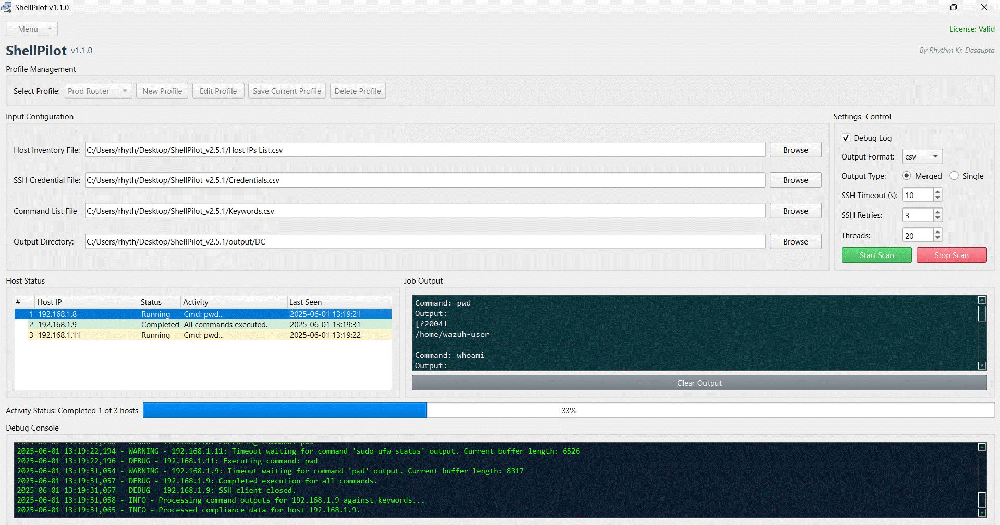
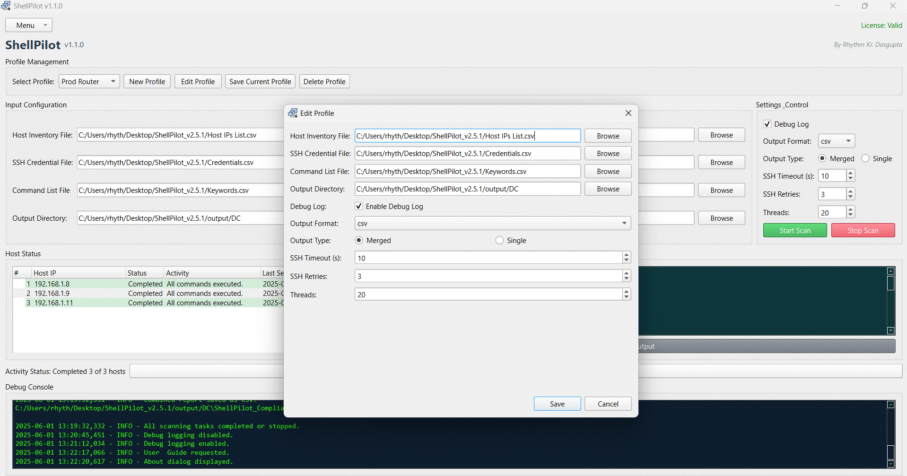
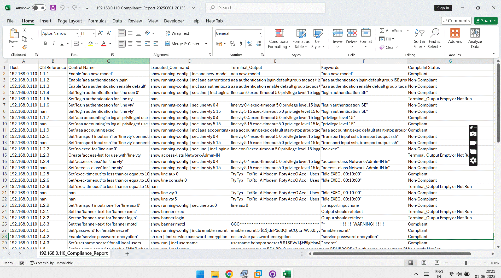

## ShellPilot User Guide

* * *


### Overview

ShellPilot is your go-to GUI application for effortlessly automating SSH command execution across multiple remote hosts. Designed with precision and ease of use in mind, it's perfect for system administrators, network engineers, and IT professionals who want to tackle bulk operations without the hassle of repetitive manual tasks.

ShellPilot simplifies complex SSH automation, giving you unparalleled control and visibility over your infrastructure right from a central application.

* * *

### Key Features

* *   **Multi-host Management:** Seamlessly manage and execute commands on a vast number of servers using **inventory files**, dramatically speeding up your administrative tasks.
* *   **Credential Handling:** Securely manage SSH credentials with dedicated **credential files**, ensuring smooth authentication every time.
* *   **Concurrent Execution:** Thanks to its multi-threading capabilities, ShellPilot can run commands **simultaneously** on multiple hosts, slashing execution time.
* *   **Job Output and Reporting:** Easily collate and display command output for each host. Plus, generate detailed **CSV or text reports** for compliance and auditing.
* *   **Debug and Logging:** Activate **debug logging** for crystal-clear transparency and efficient troubleshooting.
* *   **Intuitive Profile Management:** **Save and reuse** your configuration profiles for consistent and efficient operations across all your sessions.

* * *

### ShellPilot UI



* * *

### Getting Started

Ready to take control?

* *   **Installation**: Head over to the official repository or website to **download and install ShellPilot**.
* *   **Launching the Application**: Simply **double-click the executable file** to open ShellPilot and get started!

* * *

### User Interface Overview

ShellPilot's main window is intuitively laid out, featuring several key sections to guide you:

* *   **Top Bar**: Your access point for the **menu button** and **license status**.
* *   **Title Section**: Displays the application's **name, version**, and **developer information**.
* *   **Profile Management Section**: Where you can **select, create, edit, and delete your profiles**.
* *   **Input Configuration Section**: This is where you'll **specify your input files and settings**.
* *   **Output Frames**: Keep an eye on the **status of your hosts** and the **job output** here.
* *   **Status and Progress**: See the **current activity status** and **progress bar** at a glance.
* *   **Debug Console**: If enabled, your **debug logs** will appear here, offering enhanced transparency.

* * *

### Profile Management

ShellPilot makes managing your configurations a breeze!

* *   **Creating a New Profile**: Click the "**New Profile**" button and give your new profile a descriptive name.
* *   **Editing a Profile**: Select an existing profile from the dropdown and click "**Edit Profile**" to fine-tune its settings.
* *   **Deleting a Profile**: Choose the profile you wish to remove and click "**Delete Profile**" to clear it from your list.

* * *


### Input Configuration

ShellPilot relies on clearly formatted input files to do its magic. Here's what you need to know:

#### Host Inventory File

* *   **Purpose**: This file contains the complete list of hosts (either **IP addresses or hostnames**) where commands will be executed.
* *   **Format**: A **CSV file** with a single header row: `Host_IP`.
* *   **Selection**: Click "**Browse**" next to the "Host Inventory File" field to easily locate and select your file.

**Example:**

```
Host_IP
192.168.1.1
192.168.1.2
example.com
```

#### SSH Credential File

* *   **Purpose**: This file securely stores the **SSH usernames and passwords** needed for authentication. You can also specify the port.
* *   **Format**: A **CSV file** with headers: `username`, `password`, and optionally `port`.
* *   **Selection**: Click "**Browse**" next to the "SSH Credential File" field to select your credentials file.

**Example:**

```
username,password,port
admin,password123,22
user,securepass,22
```

#### Command List File

* *   **Purpose**: This file lists all the **commands you want to execute** on your specified hosts.
* *   **Format**: A **CSV or text file** with a header row: `Control Command`.
* *   **Selection**: Click "**Browse**" next to the "Command List File" field to select your command file.

**Example:**

```
Control Command
ls -l
df -h
uptime
```

* * *
### CISCO IOS 17 SCD Control


### Execution Control

Ready to automate?

* *   **Starting Execution**: Simply click the "**Start Scan**" button to kick off command execution on all your configured hosts.
* *   **Stopping Execution**: Need to pause? Click the "**Stop Scan**" button at any time to halt the execution process.

* * *

### Viewing Output

Once commands are executed, their output is neatly organized for you in the "**Job Output**" section. To see the specific results for a host, just select it from the "**Host Status**" tree view.

* * *
### CISCO IOS 17 Compliance Report



* * *

### Debug Logging

Gain deeper insights into ShellPilot's operations:

* *   **Enabling Debug Logging**: Check the "**Enable Debug Log**" box to activate detailed debug logging.
* *   **Viewing Debug Logs**: All related logs will be displayed in the **debug console**, aiding in troubleshooting and transparency.

* * *

### Saving and Loading Profiles

ShellPilot makes managing your configurations effortless:

* *   **Saving Current Profile**: Click "**Save Current Profile**" to save your current settings to the active profile, ensuring your work is preserved.
* *   **Loading Profiles**: No need to worry about manually loading! Your profiles are **automatically loaded** from the configuration file every time ShellPilot starts up.

* * *

### Troubleshooting

Running into a snag? Here are some common issues and quick fixes:

* *   **File Not Found**: Double-check that your specified file paths are absolutely correct and that the files actually exist in those locations.
* *   **Invalid Format**: Ensure your input files strictly adhere to the specified CSV or text formats.
* *   **SSH Connection Errors**: Verify your SSH credentials are accurate and that your hosts are reachable on the network.

* * *

### Contact and Support

Need a hand? Don't hesitate to reach out!

* *   **Rhythm Kr. Dasgupta**
* *   **linkedin**: [www.linkedin.com/in/rhythmkrdasgupta/]
* *   **ResearchGate**: [https://www.researchgate.net/profile/Rhythm-Dasgupta]

* * *

### Conclusion

ShellPilot is an incredibly powerful tool for streamlining your SSH command execution across multiple hosts. By following this user guide, you'll be able to harness its full potential for automated compliance scanning and reporting. We hope this guide helps you unlock a new level of efficiency!

Do you have any further questions about getting started with ShellPilot?
